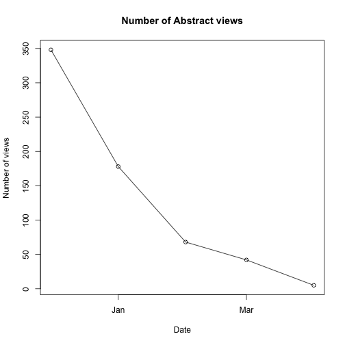

## biorxiv

*Quickly search and get details about papers on the pre-print server [biorxiv.org](http://www.biorxiv.org) in R*

**Quick Start**

Currently the package is only available on github and installable via `devtools`

```r
library(devtools)
install_github("emhart/biorxiv")
```

```
## Error in download(dest, src, auth): client error: (404) Not Found
```

```r
library(biorxiv)
```

**Searching**

The search functionality comes from the general search form interface, so the search may not be at the granularity you desire without further parsing of results.


```r
bxEco <- bx_search("Ecology",limit = 10)
summary(bxEco)
```

```
## Search term: Ecology 
## Number of results returned: 10 
## Number of results found: 145
```

This will return a search results object that has the URL's for your search results.  If you want to get details about all your search results we can extract basic features like DOI, Authors, e-mails, title, abstract text, date as well as metrics on views and downloads.


```r
bxEcoDetails <-  bx_extract(bxEco)
```

```
## Error in matrix(metrics, ncol = 3, nrow = length(metrics)/3, byrow = T): 'data' must be of a vector type, was 'NULL'
```

```r
bxEcoDetails[[1]]
```

```
## $authors
## $authors$names
##  [1] "Peter Søgaard Jørgensen " "Frédéric Barraquand "    
##  [3] "Vincent Bonhomme "        "Timothy J Curran "       
##  [5] "Ellen Cieraad "           "Thomas Ezard "           
##  [7] "Laureano Gherardi "       "R. Andrew Hayes "        
##  [9] "Timothée Poisot "         "Roberto Salguero-Gómez " 
## [11] "Lucía DeSoto "            "Brian Swartz "           
## [13] "Jennifer M. Talbot "      "Brian Wee "              
## [15] "Naupaka Zimmerman "      
## 
## $authors$email
## [1] "psjoergensen@gmail.com"
## 
## 
## $paper
## $paper$title
## [1] "Connecting people and ideas from around the world: global innovation platforms for next-generation ecology and beyond"
## 
## $paper$abstract
## [1] "We present a case for using global community innovation platforms (GCIPs), an approach to improve innovation and knowledge exchange in international scientific communities through a common and open online infrastructure. We highlight the value of GCIPs by focusing on recent efforts targeting the ecological sciences, where GCIPs are of high relevance given the urgent need for interdisciplinary, geographical, and cross-sector collaboration to cope with growing challenges to the environment as well as the scientific community itself. Amidst the emergence of new international institutions, organizations, and dedicated meetings, GCIPs provide a stable international infrastructure for rapid and long-term coordination that can be accessed by any individual. The accessibility can be particularly important for researchers early in their careers. Recent examples of early career GCIPs complement an array of existing options for early career scientists to improve skill sets, increase academic and social impact, and broaden career opportunities. In particular, we provide a number of examples of existing early career initiatives that incorporate elements from the GCIPs approach, and highlight an in-depth case study from the ecological sciences: the International Network of Next-Generation Ecologists (INNGE), initiated in 2010 with support from the International Association for Ecology and 18 member institutions from six continents."
## 
## $paper$date
## [1] "2014-12-14"
## 
## $paper$DOI
## [1] "10.1101/012666"
## 
## $paper$fulltext_url
## [1] "http://www.biorxiv.org/content/early/2014/12/14/012666.full.pdf"
## 
## 
## $metrics
##         date Abstract PDF
## 1 2014-12-01      348  26
## 2 2015-01-01      178  39
## 3 2015-02-01       68  49
## 4 2015-03-01       42  19
## 5 2015-04-01        5   1
## 
## attr(,"class")
## [1] "biorxiv_paper"
```

There's also some basic plotting functionality that will allow you plot views and downloads

Plot views

```r
plot(bxEcoDetails[[1]],type="abs")
```

 

Plot downloads

```r
plot(bxEcoDetails[[1]],type="dl")
```

 

Finally, you can easily download PDF's from all your search results.


```r
bx_download(bxEco,"~/biorxiv_pdfs")
```


